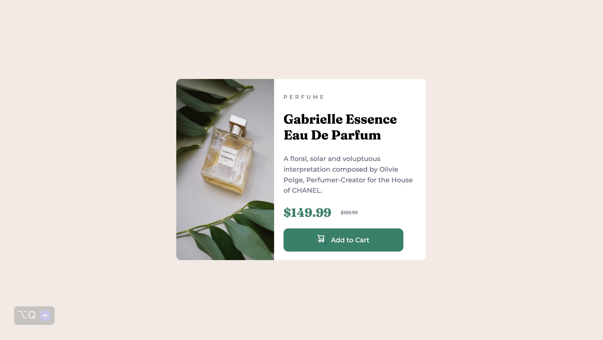

# Frontend Mentor - Product preview card component solution

This is my solution to the [Product preview card component challenge on Frontend Mentor](https://www.frontendmentor.io/challenges/product-preview-card-component-GO7UmttRfa). 

## Table of contents

- [Overview](#overview)
  - [The challenge](#the-challenge)
  - [Screenshot](#screenshot)
  - [Links](#links)
- [My process](#my-process)
  - [Built with](#built-with)
  - [Continued development](#continued-development)
- [Author](#author)

## Overview

### The challenge

Users should be able to:

- View the optimal layout depending on their device's screen size
- See hover and focus states for interactive elements

### Screenshot

Above is a screenshot of my solution.

### Links

- Solution URL: [Github Repo](https://github.com/cheytes/Frontend-Projects/tree/main/L1-Projects/product-preview-card-component-main)
- Live Site URL: [Add live site URL here](https://your-live-site-url.com)

## My process

### Built with

- Semantic HTML5 markup
- CSS custom properties
- Flexbox
- Desktop-first workflow

### Continued development

This project allowed me to familiarize with concepts that I have became rusty on during my break. However, I'm becoming more fluent in my languages.

## Author

- Frontend Mentor - [@cheytes](https://www.frontendmentor.io/profile/cheytes)

